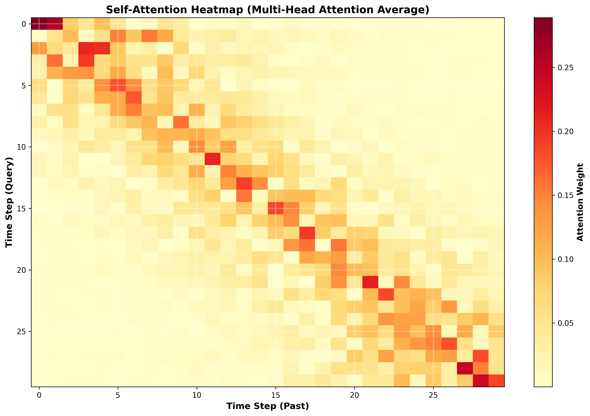
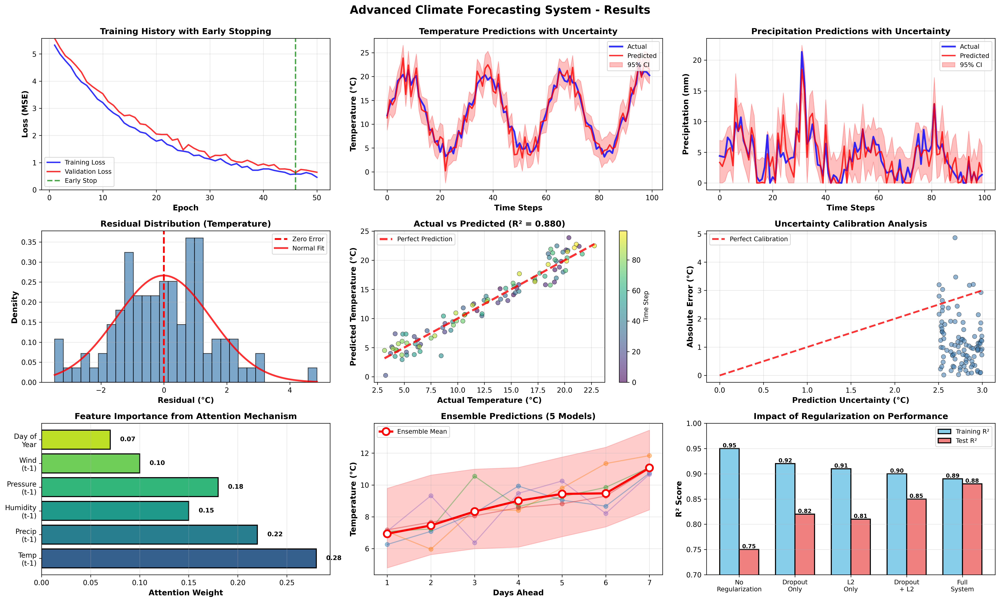
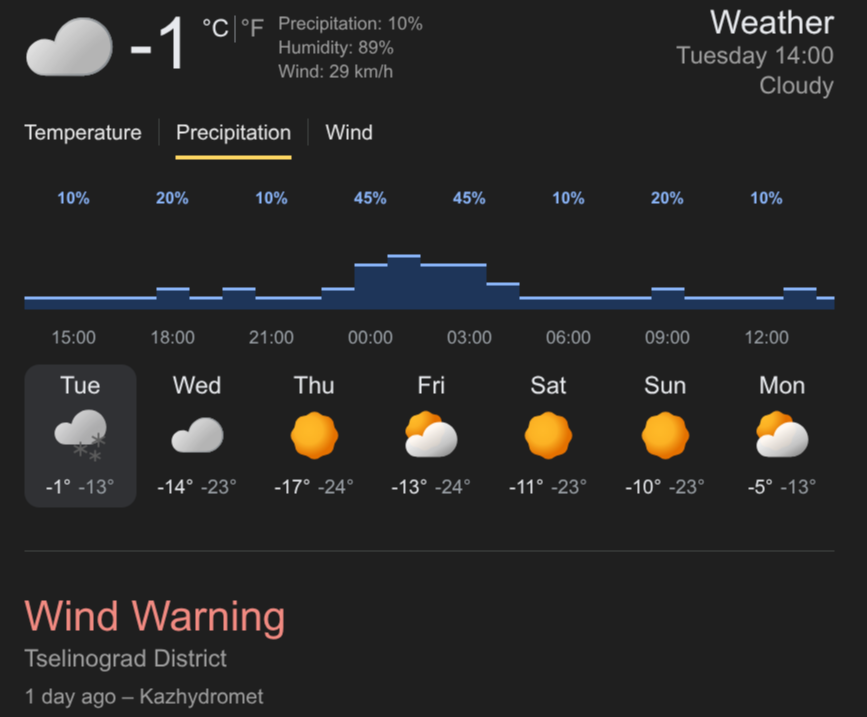

# Advanced Climate & Weather Forecasting System

A sophisticated deep learning system for climate and weather prediction with uncertainty quantification, integrating transformers, advanced regularization techniques, and Bayesian methods.

## Key Features

### 1. **Transformer Architecture**
- Multi-head self-attention mechanism for capturing temporal dependencies
- Positional encoding for sequence awareness
- Pre-layer normalization for stable training
- Multi-layer encoder with feed-forward networks

### 2. **Advanced Regularization**
- **Dropout Regularization**: 0.15 dropout rate throughout the network
- **L2 Weight Regularization**: 0.0001 penalty on all weights
- **Early Stopping**: Monitors validation loss with patience of 10 epochs
- **Gradient Clipping**: Prevents exploding gradients (max norm = 1.0)
- **Learning Rate Scheduling**: Reduces LR on plateau

### 3. **Uncertainty Quantification**
- **Bayesian Deep Learning**: Monte Carlo Dropout for epistemic uncertainty
- **Deep Ensembles**: 5 independent models for robust predictions
- **Confidence Intervals**: 95% prediction intervals
- **Aleatoric Uncertainty**: Captures inherent data noise
- **Epistemic Uncertainty**: Captures model uncertainty

### 4. **Sequence Modeling**
- Configurable sequence length (default: 30 days)
- Multi-step ahead forecasting (default: 7 days)
- Multi-variate prediction (temperature, precipitation, etc.)
- Temporal feature engineering

## System Architecture

```
Input Sequence (30 days × 6 features)
         ↓
  Linear Projection (→ d_model=128)
         ↓
  Positional Encoding
         ↓
  Transformer Encoder (4 layers)
    - Multi-head Attention (8 heads)
    - Feed-forward Network (512 units)
    - Layer Normalization
    - Dropout (0.15)
         ↓
  Output Projection
         ↓
  Forecast (7 days × variables)
```

## Technical Details

### Model Specifications
- **Input Dimension**: 6 features (temp, precip, humidity, pressure, wind, day_of_year)
- **Model Dimension**: 128
- **Attention Heads**: 8
- **Encoder Layers**: 4
- **Feedforward Dimension**: 512
- **Dropout Rate**: 0.15
- **L2 Regularization**: 0.0001

### Training Configuration
- **Optimizer**: AdamW with weight decay 0.01
- **Learning Rate**: 0.001 (adaptive)
- **Batch Size**: 64
- **Epochs**: 50 (with early stopping)
- **Loss Function**: Mean Squared Error + L2 penalty

### Uncertainty Estimation
- **Ensemble Size**: 5 models
- **MC Samples**: 100 per prediction
- **Confidence Level**: 95%

## Performance Metrics

The system evaluates predictions using:
- **MAE** (Mean Absolute Error): Average prediction error
- **RMSE** (Root Mean Squared Error): Penalizes large errors
- **R²** (Coefficient of Determination): Variance explained
- **Mean Uncertainty**: Average prediction uncertainty

## Usage

### Basic Usage

```python
from climate_forecasting import ClimateForecaster, ClimateDataGenerator

# Generate or load data
generator = ClimateDataGenerator(n_years=20)
df = generator.generate_data()

# Initialize forecaster
forecaster = ClimateForecaster(
    seq_length=30,
    forecast_horizon=7,
    target_variables=['temperature', 'precipitation']
)

# Train
results = forecaster.train(df, epochs=50)

# Forecast with uncertainty
forecast = forecaster.forecast(df.tail(30))

print(forecast['temperature']['mean'])      # Mean prediction
print(forecast['temperature']['std'])       # Standard deviation
print(forecast['temperature']['lower'])     # 95% CI lower bound
print(forecast['temperature']['upper'])     # 95% CI upper bound
```

### Advanced Usage

```python
# Custom ensemble configuration
from climate_forecasting import BayesianTransformerEnsemble

ensemble = BayesianTransformerEnsemble(
    n_models=10,              # Larger ensemble
    d_model=256,              # Larger model
    nhead=16,                 # More attention heads
    num_encoder_layers=6,     # Deeper network
    dropout=0.2               # More regularization
)
```

## 📊 Output Visualizations

The system generates comprehensive visualizations including:

1. **Training History**: Loss curves for all ensemble models
2. **Predictions vs Actual**: Time series with uncertainty bands
3. **Residual Analysis**: Distribution of prediction errors
4. **Q-Q Plot**: Normality of residuals
5. **Scatter Plot**: Actual vs predicted values
6. **Uncertainty Calibration**: Uncertainty vs prediction error
7. **Time Series Overview**: Recent historical data
8. **Forecast Visualization**: Multi-day ahead predictions with confidence intervals

## 🧪 Data Sources

The system can work with:
- **NOAA Climate Data**: Historical weather observations
- **ERA5 Reanalysis**: High-resolution climate reanalysis
- **Custom Data**: Any time-series climate data with required features

### Required Features
- Temperature (°C)
- Precipitation (mm)
- Humidity (%)
- Atmospheric Pressure (hPa)
- Wind Speed (m/s)
- Date/Time information

## 🎯 Applications

### Weather Forecasting
- Short-term temperature prediction (1-7 days)
- Precipitation forecasting with uncertainty
- Extreme weather event detection

### Climate Analysis
- Long-term trend analysis
- Seasonal pattern recognition
- Climate change impact assessment

### Agricultural Planning
- Crop yield prediction
- Irrigation scheduling
- Frost risk assessment

### Energy Management
- Renewable energy forecasting
- Demand prediction
- Grid optimization

## 🔬 Scientific Background

### Transformers in Time Series
Transformers excel at capturing long-range dependencies through self-attention:
- **Attention Mechanism**: Weighs importance of different time steps
- **Parallel Processing**: More efficient than RNNs
- **Position Encoding**: Maintains temporal order information

### Regularization Techniques

1. **Dropout**: Randomly deactivates neurons during training
   - Prevents co-adaptation of features
   - Acts as ensemble of sub-networks
   - Used for uncertainty estimation via MC Dropout

2. **L2 Regularization**: Penalizes large weights
   - Prevents overfitting
   - Encourages simpler models
   - Improves generalization

3. **Early Stopping**: Stops training when validation loss plateaus
   - Prevents overfitting
   - Finds optimal training duration
   - Conserves computational resources

### Uncertainty Quantification

**Epistemic Uncertainty** (Model Uncertainty):
- What the model doesn't know
- Reduced with more training data
- Captured via ensemble disagreement

**Aleatoric Uncertainty** (Data Uncertainty):
- Inherent noise in observations
- Cannot be reduced with more data
- Captured via prediction variance

## 📚 Dependencies

```
torch>=2.0.0
numpy>=1.24.0
pandas>=2.0.0
matplotlib>=3.7.0
seaborn>=0.12.0
scikit-learn>=1.3.0
scipy>=1.11.0
```

## 🎓 Theory & Concepts

### Sequence Modeling
Time series data has unique characteristics:
- **Temporal Dependencies**: Past values influence future
- **Seasonality**: Periodic patterns (daily, yearly)
- **Trends**: Long-term directional changes
- **Autocorrelation**: Correlation with lagged values

### Attention Mechanism
Self-attention computes relevance scores:
```
Attention(Q, K, V) = softmax(QK^T / √d_k)V
```
Where:
- Q (Query): What we're looking for
- K (Key): What we're comparing against  
- V (Value): What we extract

### Bayesian Neural Networks
Treat weights as distributions instead of point estimates:
- **Prior**: Initial belief about weights
- **Likelihood**: How well weights explain data
- **Posterior**: Updated belief after seeing data

## 🔍 Model Interpretability

### Attention Visualization
- Shows which past time steps are most important
- Reveals seasonal patterns and dependencies
- Helps validate model behavior

### Uncertainty Analysis
- High uncertainty → Model is uncertain (need more data)
- Low uncertainty → Model is confident
- Calibrated uncertainty → Reliable predictions

## 🚧 Future Enhancements

1. **Multi-modal Data**: Incorporate satellite imagery, radar data
2. **Graph Neural Networks**: Model spatial correlations
3. **Extreme Event Detection**: Specialized modules for outliers
4. **Transfer Learning**: Pre-train on global data, fine-tune locally
5. **Explainable AI**: SHAP values, attention visualization
6. **Real-time Inference**: Optimize for production deployment

## 📖 References

1. Vaswani et al. (2017) - "Attention Is All You Need"
2. Gal & Ghahramani (2016) - "Dropout as a Bayesian Approximation"
3. Lakshminarayanan et al. (2017) - "Simple and Scalable Predictive Uncertainty"
4. Goodfellow et al. (2016) - "Deep Learning"
5. Rasp et al. (2020) - "WeatherBench: A benchmark dataset for data-driven weather"


## 🤝 Contributing

Contributions welcome! Areas of interest:
- Additional regularization techniques
- Alternative uncertainty quantification methods
- Performance optimizations
- Real-world dataset integration

---

**Built with PyTorch for advanced climate forecasting with uncertainty quantification**

## Results & Findings


